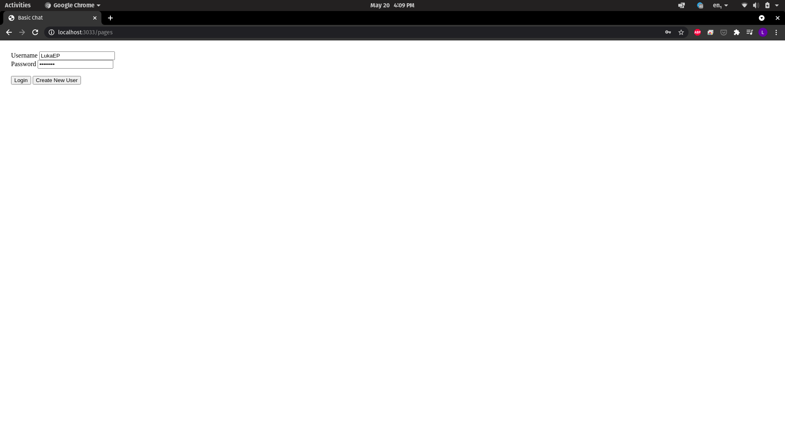

# Basic Chat

## Introduction

This is a basic chat built in NodeJS using Typescript, with Express as framework. The database used was MongoDB, for its simplicity and velocity. And to handle the communication, between server and client side, Socket.io was choosen.

## Instalation

First of all, install the dependencies:
```bash
npm install
```
After this, copy the ".env.example" to ".env":
```bash
cp .env.example .env
```
Inside the ".env" file, put your MongoDB url in the MONGO_URL variable:
```txt
MONGO_URL=<your_mongodb_url>
```
> I used the [MongoDB Cloud](https://www.mongodb.com/1). It's very simple to use, if you don't know how I recommend going to the [documentation](https://docs.atlas.mongodb.com/getting-started/).

To start the application run "npm run dev":
```bash
npm run dev

> basic-chat@1.0.0 dev
> tsnd src/server.ts

[INFO] 09:00:01 ts-node-dev ver. 1.1.6 (using ts-node ver. 9.1.1, typescript ver. 4.2.4)
Server up on port 3033!
MongoDB Connected
```

## Usage

After starting the application go to http://localhost:3033/pages. This is the main page, where you can create an user with password to chat with anyone.

If the username you typed still doesn't exists, you can create a new user clicking "Create New User". Or if you want to login, click the "Login" button.



After clicking Login/Create New User you will be redirected to the chats page, where you can start chatting.


To start a new chat, just type the username of another user in the "Start Chat" field, and click on "Call" button. It will show the username of the user you just called.


To start chatting is just click on the chat, the page will reload and open the messages with a text field, to send new messages.


To log out of the chat, just click Logout.

## Credits

This project was based on another code from an event ([NLW#5](https://rseat.in/nlw5)). Unfortunately, this event isn't available anymore. But the original code is still available on GitHub.

[Link](https://github.com/EliasGcf/nlw-05-nodejs) to the original code.

## License
This project is [MIT licensed](LICENSE.txt).